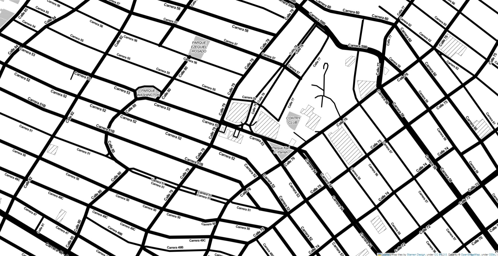

# Proyecto-SAIAE
**Proyecto Académico:**
Sistema que facilita a los organismos de socorro la atención “inmediata” ante accidentes de tránsito.

# Ejecución
~ python SAIAE.py nombre_imagen.jpeg despliegue.txt emergencias.txt

# Inputs
Imagen en escala de grises que representa un sector específico de Barranquilla.  
Ejemplo:

Adicionalmente, se facilitarán dos archivos, el archivo despliegue.txt (ej., despliegue.txt)  indica la manera como se encuentran desplegados los vehículos de socorro en el instante de tiempo actual; por línea, el formato de este archivo es el siguiente:
  
- tipo de vehículo, posición en x (longitud - lo que en una matriz llamamos j), posición en y (latitud - lo que en una matriz llamamos i), código de vehiculo

- Tipo de vehículo: B carro de bomberos, P patrulla de policía, y A ambulancia.

- Ejemplos:
     B, 10, 10, COD01 indica que un carro de bomberos con código 01 se encuentra ubicado en el pixel (10, 10)
     
- Pueden haber varios vehículos de igual o distinto tipos superpuestos.

- Si la posición (pixel) de un vehículo de socorro no coincide con un camino, deberá ubicar el vehículo en el píxel más cercano que represente camino.

Por su parte, el archivo emergencias.txt (ej., emergencias.txt) denota las emergencias que requieren ser atendidas; por línea, el formato de este archivo es el siguiente:
- código de emergencia, posición en x (longitud), posición en y (latitud), tipo de vehículo requerido.
- Código de Emergencia: Este código identifica el tipo de emergencia (por ejemplo, EME01). La repetición del mismo código en distintas líneas del archivo de entrada indica la necesidad de múltiples vehículos, ya sean del mismo tipo o de diferentes categorías, tal como se describió previamente. Las coordenadas especificadas corresponden a la ubicación de la emergencia, y el tipo de vehículo requerido se asigna de acuerdo con las categorías que se han explicado con anterioridad.
  Ejemplo: EME02, 10, 10, A indica que la emergencia con código 02 ubicada en el pixel (10, 10) requiere una ambulancia.
- Si se reporta una emergencia en un píxel que no corresponde a un camino, deberá reubicarse en el píxel más cercano que sí denota un camino. Es posible que se informen múltiples emergencias en una misma ubicación.

Outputs

Las salidas del programa son las siguientes:
- nombre_imagen_despliegue.jpeg: esta imagen mostrará la configuración inicial del escenario, antes de la respuesta a las emergencias. Se debe utilizar la imagen base para señalizar con puntos rojos las posiciones de los camiones de bomberos, con puntos verdes las localizaciones de las patrullas de policía, y con puntos azules las ubicaciones de las ambulancias. Además, se marcarán los sitios de las emergencias con puntos de color fucsia.
- nombre_imagen_atencion.jpeg: esta imagen reflejará la situación del escenario después de la intervención en las emergencias. Partiendo de la imagen original, se deberán ilustrar tanto las emergencias como los vehículos de respuesta, empleando la misma paleta de colores descrita previamente. Adicionalmente, se trazarán las trayectorias que cada vehículo recorre para alcanzar las emergencias asignadas, utilizando el color correspondiente a cada tipo de vehículo para sus respectivas rutas.
- atención.txt: este archivo de texto indicará para cada emergencia (por línea) cuáles vehículos fueron asignados, ejemplo: EME01: COD01, COD05, … etc.

